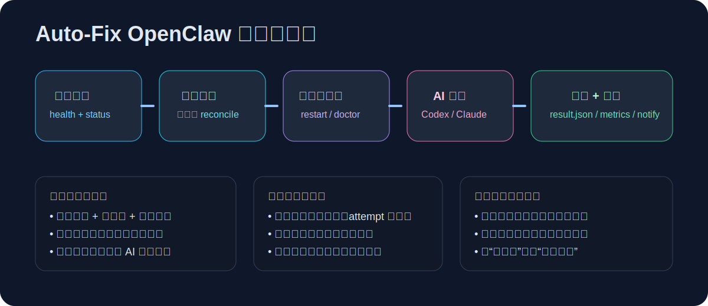
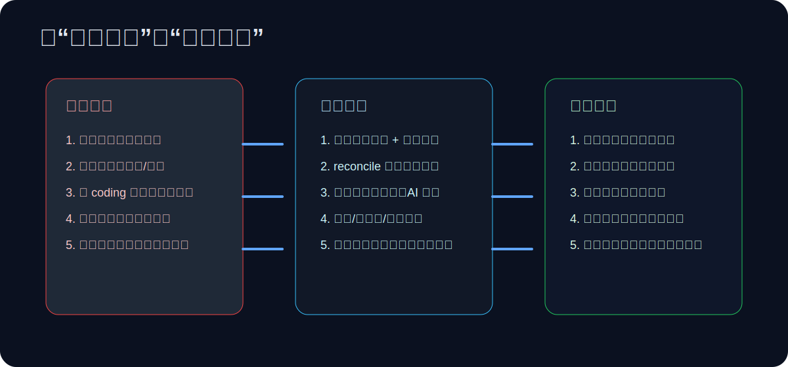

<p align="center">
  
</p>

<h1 align="center">auto-fix-openclaw</h1>

<p align="center">
  Production-grade self-heal framework for OpenClaw gateway.<br/>
  把“龙虾断联 + 升级回归 + 多环境适配”变成可持续自愈。
</p>

<p align="center">
  <a href="./docs/project-intro.zh-CN.md">中文项目介绍</a> ·
  <a href="./marketing/gate-home/index.html">Gate 图形化首页</a> ·
  <a href="./docs/marketing/seo-playbook.zh-CN.md">SEO整套方案</a> ·
  <a href="./docs/marketing/ad-plan.zh-CN.md">广告投放方案</a>
</p>

## 为什么会做这个项目

我们在真实使用场景里遇到过反复出现的问题：

- 龙虾（OpenClaw）在高压工作流中偶发断联，影响任务连续性
- 升级后出现配置漂移/依赖变化，导致连接稳定性下降
- 多 coding 产品和多环境并存，维护和排障成本持续上升

`auto-fix-openclaw` 的目标不是“修一次”，而是搭建一套可持续运行的自愈系统。

## 图形化介绍

### 自愈流水线



### 痛点 -> 方案 -> 结果



## 核心能力

- **持续探测**：`openclaw health --json` + `openclaw gateway status --json`
- **确定性修复优先**：restart -> doctor -> service manager
- **AI 兜底修复**：Codex / Claude Code 双 provider，支持 fallback
- **升级回放**：版本变更可自动 reconcile，回放本地 customization
- **防抖控制**：cooldown + daily cap + circuit breaker
- **可观测性**：attempt 级审计、result.json、Prometheus metrics、通知路由

## Quick Start

```bash
cd auto-fix-openclaw
./install.sh --launchd --init-baseline   # macOS
# or
./install.sh --systemd --init-baseline   # Linux

auto-fix-openclaw status
auto-fix-openclaw run-once --source bootstrap-verify
```

## 常用命令

```bash
auto-fix-openclaw run-once --source manual
auto-fix-openclaw repair-now --provider codex
auto-fix-openclaw repair-now --provider claudecode
auto-fix-openclaw check
auto-fix-openclaw metrics
auto-fix-openclaw doctor-dry-run
auto-fix-openclaw reset-state
```

## 安全与兼容

- `AUTO_FIX_OPENCLAW_COMMAND_EXEC_MODE=safe|shell`
  - `safe`：默认，argv 解析执行，降低命令注入风险
  - `shell`：兼容旧配置（支持 shell 操作符）
- `AUTO_FIX_OPENCLAW_REPAIR_ON_DEGRADED=0|1`
  - `0`：默认，degraded 只记录不修复
  - `1`：degraded 也进入修复链路

## 宣传与增长资产

- Gate 首页（LOGO + 图形化介绍）：`marketing/gate-home/`
- 中文项目介绍：`docs/project-intro.zh-CN.md`
- 小红书文案包：`marketing/xiaohongshu/campaign-kit.zh-CN.md`
- SEO整套方案：`docs/marketing/seo-playbook.zh-CN.md`
- 广告投放方案：`docs/marketing/ad-plan.zh-CN.md`

## License

MIT
